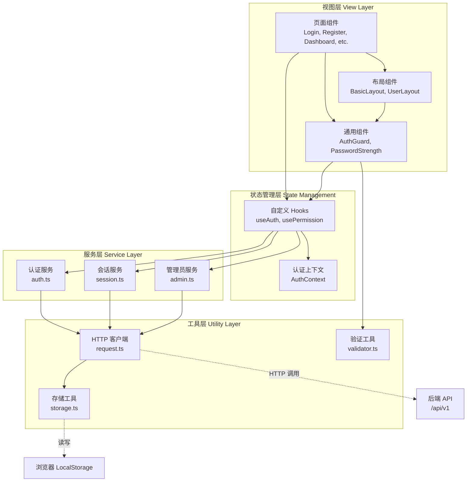
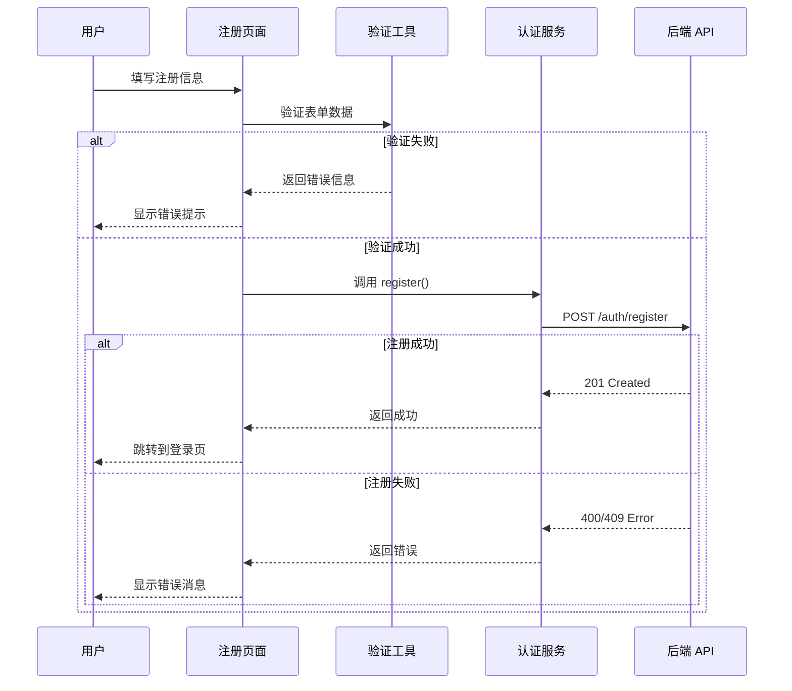
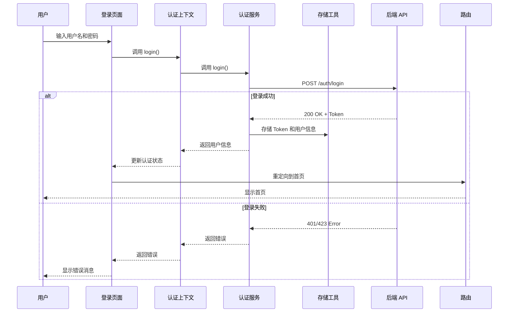
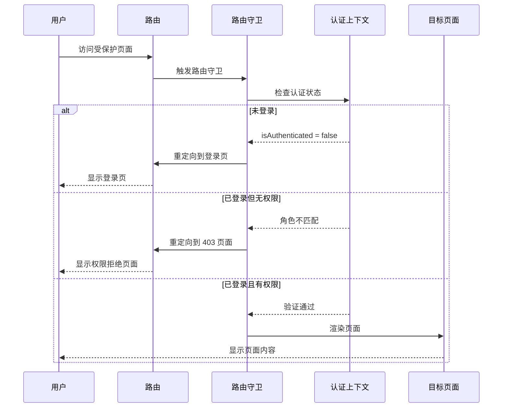
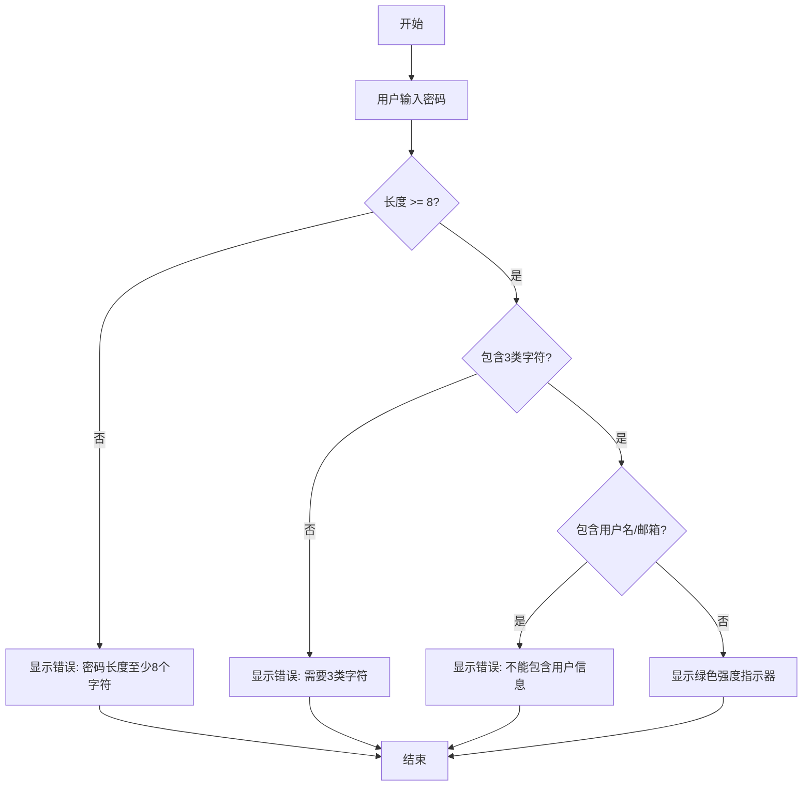

# 设计文档

## 1. 概述

本设计文档描述了基于 Ant Design Pro 6.x 和 Ant Design 5.x 的前端应用架构。系统采用 React 18.x + TypeScript 5.x + Vite 5.x 技术栈，实现用户注册、登录、基于角色的访问控制（RBAC）和会话管理功能。

### 1.1 设计目标

1. **安全性**: 实现完整的身份认证和授权机制，保护用户数据和系统资源
2. **可维护性**: 采用模块化架构，清晰的代码组织和类型安全
3. **用户体验**: 提供流畅的交互体验，清晰的错误提示和加载状态
4. **可扩展性**: 支持未来功能扩展，如多因素认证、第三方登录等
5. **性能**: 优化首屏加载时间，实现代码分割和懒加载

### 1.2 系统边界

**系统内部**（需要实现）:
- 用户注册和登录界面
- 基于角色的路由和菜单系统
- 用户管理界面（管理员）
- 审计日志查看界面（管理员）
- 会话管理和 Token 处理

**系统外部**（外部依赖）:
- 后端 API 服务（提供认证、用户管理、审计日志等接口）
- 浏览器环境（LocalStorage、Cookie 支持）

**关键交互**:
- 用户通过浏览器访问前端应用
- 前端通过 HTTP/HTTPS 与后端 API 通信
- 前端使用 LocalStorage 存储 Token 和用户偏好


## 2. 架构决策记录（ADR）

### ADR-001: 选择 React 18.x 作为前端框架

**状态**: 已采纳

**背景**: 需要选择一个成熟、高性能的前端框架来构建企业级应用。

**决策**: 选择 React 18.x

**理由**:
- 提供并发特性（Concurrent Features），提升用户体验
- 自动批处理（Automatic Batching），减少不必要的重渲染
- 生态系统成熟，社区活跃
- 与 Ant Design Pro 完美集成

**替代方案**:
- Vue 3: 学习曲线较平缓，但 Ant Design Pro 主要支持 React
- Angular: 功能完整但较重，不适合中小型项目

### ADR-002: 选择 TypeScript 5.x 进行类型安全

**状态**: 已采纳

**背景**: 需要在开发阶段发现类型错误，提高代码质量。

**决策**: 使用 TypeScript 5.x，启用严格模式

**理由**:
- 提供静态类型检查，减少运行时错误
- 改善 IDE 智能提示和重构能力
- 提高代码可维护性和可读性

**替代方案**:
- JavaScript + JSDoc: 类型检查不够严格

### ADR-003: 选择 Ant Design 5.x 作为 UI 组件库

**状态**: 已采纳

**背景**: 需要一个成熟的企业级 UI 组件库，快速构建界面。

**决策**: 使用 Ant Design 5.x 和 Ant Design Pro 6.x

**理由**:
- 企业级设计语言，组件丰富且成熟
- 支持主题定制和国际化
- Ant Design Pro 提供开箱即用的中后台解决方案
- 与后端 Spring Boot 技术栈常见搭配

**替代方案**:
- Material-UI: 设计风格偏向 Google Material Design
- Element Plus: 主要面向 Vue 生态

### ADR-004: 选择 Vite 5.x 作为构建工具

**状态**: 已采纳

**背景**: 需要快速的开发服务器和高效的生产构建。

**决策**: 使用 Vite 5.x

**理由**:
- 开发服务器启动速度极快（基于 ESM）
- 热模块替换（HMR）性能优秀
- 生产构建基于 Rollup，输出优化
- 配置简单，开箱即用

**替代方案**:
- Webpack: 配置复杂，启动速度慢
- Create React App: 不够灵活，配置受限

### ADR-005: 使用 React Context + Hooks 进行状态管理

**状态**: 已采纳

**背景**: 需要管理全局认证状态和用户信息。

**决策**: 使用 React Context API + Hooks，不引入 Redux

**理由**:
- 应用状态相对简单，不需要复杂的状态管理库
- React Context 足够满足需求
- 减少依赖，降低学习成本
- 避免 Redux 的样板代码

**替代方案**:
- Redux Toolkit: 功能强大但对当前项目过于复杂
- Zustand: 轻量但不如 Context 原生

### ADR-006: 使用 Axios 作为 HTTP 客户端

**状态**: 已采纳

**背景**: 需要一个功能完善的 HTTP 客户端库。

**决策**: 使用 Axios 进行 API 请求

**理由**:
- 支持请求和响应拦截器（用于统一处理认证和错误）
- 支持请求取消和超时控制
- 自动转换 JSON 数据
- 社区成熟，文档完善

**替代方案**:
- Fetch API: 原生但功能较少，需要额外封装


## 3. 高层设计

### 3.1 静态结构设计

#### 3.1.1 系统架构

系统采用**分层架构模式**，从上到下分为四层：



#### 3.1.2 模块划分

| 模块名称 | 职责 | 主要组件/文件 | 依赖模块 |
|---------|------|--------------|---------|
| 视图层 | UI 渲染和用户交互 | Login, Register, Dashboard, UserManagement, AuditLog | 状态管理层、通用组件 |
| 状态管理层 | 全局状态管理 | AuthContext, useAuth, usePermission | 服务层 |
| 服务层 | API 调用封装 | auth.ts, session.ts, admin.ts | 工具层 |
| 工具层 | 通用工具函数 | request.ts, storage.ts, validator.ts | 无 |

#### 3.1.3 技术栈

| 技术领域 | 选型 | 版本 | 用途 |
|---------|------|------|------|
| 前端框架 | React | 18.x | UI 构建 |
| 类型系统 | TypeScript | 5.x | 类型安全 |
| UI 组件库 | Ant Design | 5.x | 企业级组件 |
| 中后台方案 | Ant Design Pro | 6.x | 布局和模板 |
| 路由 | React Router | 6.x | 前端路由 |
| HTTP 客户端 | Axios | 最新稳定版 | API 请求 |
| 构建工具 | Vite | 5.x | 开发和构建 |
| 单元测试 | Vitest | 最新稳定版 | 单元测试 |
| 属性测试 | fast-check | 最新稳定版 | 属性基础测试 |

#### 3.1.4 模块间接口协议

**前端内部模块通信**:
- 视图层 → 状态管理层: React Context API
- 状态管理层 → 服务层: 函数调用（Promise）
- 服务层 → 工具层: 函数调用

**前端与后端通信**:
- 协议: HTTP/HTTPS
- 数据格式: JSON
- 认证方式: Bearer Token (JWT)
- 基础路径: `/api/v1`

### 3.2 动态行为设计

#### 3.2.1 核心业务流程

**流程 1: 用户注册流程**



**流程 2: 用户登录流程**



**流程 3: 权限检查流程**



### 3.3 辅助设计

#### 3.3.1 性能策略

**代码分割**:
- 使用 React.lazy 和 Suspense 实现路由级别的代码分割
- 按需加载页面组件，减少首屏加载时间

**组件优化**:
- 使用 React.memo 避免不必要的重渲染
- 使用 useMemo 和 useCallback 缓存计算结果和回调函数

**资源优化**:
- 图片懒加载
- Ant Design 组件按需导入
- Vite 自动进行 Tree Shaking

#### 3.3.2 安全策略

**认证和授权**:
- 使用 JWT Token 进行身份认证
- Token 存储在 LocalStorage
- 所有 API 请求自动添加 Authorization 头

**XSS 防护**:
- React 默认转义所有渲染内容
- 避免使用 dangerouslySetInnerHTML

**CSRF 防护**:
- 由后端处理 CSRF Token
- 使用 SameSite Cookie 属性

#### 3.3.3 可观测性策略

**错误监控**:
- 使用 ErrorBoundary 捕获组件错误
- 记录错误到控制台（开发环境）

**日志策略**:
- 开发环境：详细日志
- 生产环境：仅记录错误


## 4. 详细设计

### 4.1 静态结构设计

#### 4.1.1 API 接口定义

**后端 API 基础路径**: `/api/v1`

**认证方式**: Bearer Token（JWT）

**API 端点列表**:

| 端点 | 方法 | 描述 | 认证 |
|------|------|------|------|
| `/auth/register` | POST | 用户注册 | 否 |
| `/auth/login` | POST | 用户登录 | 否 |
| `/auth/logout` | POST | 用户登出 | 是 |
| `/session/validate` | GET | 验证会话 | 是 |
| `/session/force-logout-others` | POST | 强制登出其他设备 | 是 |
| `/admin/accounts/{accountId}/unlock` | POST | 解锁账号 | 是（管理员）|

**API 响应格式**:

所有 API 响应遵循统一格式：

```typescript
interface ApiResponse<T> {
  code: number;          // 0表示成功，其他为错误码
  message: string;       // 响应消息
  data: T | null;        // 响应数据
}
```

**HTTP 状态码映射**:
- 200: 操作成功
- 201: 创建成功（注册）
- 400: 请求参数无效
- 401: 未授权（Token 无效或过期）
- 403: 无权限（非管理员）
- 404: 资源不存在
- 409: 资源冲突（用户名或邮箱已存在）
- 423: 账号已锁定
- 500: 服务器内部错误

#### 4.1.2 数据结构设计

**核心实体**:

| 实体 | 属性 | 类型 | 必需 | 描述 |
|------|------|------|------|------|
| User | userId | number | 是 | 用户 ID |
| User | username | string | 是 | 用户名 |
| User | email | string | 是 | 邮箱 |
| User | role | UserRole | 是 | 用户角色 |
| User | createdAt | string | 否 | 创建时间 |
| User | lastLoginAt | string | 否 | 最后登录时间 |
| User | isLocked | boolean | 否 | 是否锁定 |
| User | lockUntil | string | 否 | 锁定截止时间 |

**枚举定义**:

| 枚举类型 | 值 | 描述 |
|---------|-----|------|
| UserRole | ROLE_USER | 普通用户 |
| UserRole | ROLE_ADMIN | 系统管理员 |

#### 4.1.3 核心组件接口

**AuthContext 接口**:

```typescript
interface AuthContextType {
  user: User | null;
  token: string | null;
  isAuthenticated: boolean;
  isLoading: boolean;
  login: (credentials: LoginRequest) => Promise<void>;
  logout: () => Promise<void>;
  register: (data: RegisterRequest) => Promise<void>;
  checkAuth: () => Promise<void>;
}
```

**AuthGuard 组件接口**:

```typescript
interface AuthGuardProps {
  children: React.ReactNode;
  requiredRoles?: UserRole[];
  redirectTo?: string;
}
```

### 4.2 动态行为设计

#### 4.2.1 详细业务流程

**密码强度验证流程**:



#### 4.2.2 状态机设计

**会话状态机**:

| 当前状态 | 触发事件 | 条件 | 目标状态 | 副作用 |
|---------|---------|------|---------|--------|
| 未登录 | login() | 凭证正确 | 已登录 | 存储 Token，更新用户信息 |
| 未登录 | login() | 凭证错误 | 未登录 | 显示错误消息 |
| 已登录 | logout() | - | 未登录 | 清除 Token，清除用户信息 |
| 已登录 | Token 过期 | - | 未登录 | 清除 Token，重定向到登录页 |
| 已登录 | 401 错误 | - | 未登录 | 清除 Token，重定向到登录页 |

### 4.3 辅助设计

#### 4.3.1 错误处理

**错误分类和处理策略**:

| 错误类型 | HTTP 状态码 | 处理策略 |
|---------|------------|---------|
| 网络错误 | - | 显示"网络连接失败，请检查网络设置" |
| 认证错误 | 401 | 清除 Token，重定向到登录页 |
| 权限错误 | 403 | 重定向到 403 页面 |
| 账号锁定 | 423 | 显示锁定消息和剩余时间 |
| 业务错误 | 400, 409 | 显示后端返回的错误消息 |
| 服务器错误 | 500 | 显示"服务器错误，请稍后重试" |

#### 4.3.2 表单验证规则

**用户名验证**:
- 长度: 3-20 个字符
- 字符集: 字母、数字、下划线
- 正则表达式: `^[a-zA-Z0-9_]{3,20}$`

**邮箱验证**:
- 格式: 标准邮箱格式
- 最大长度: 100 个字符
- 正则表达式: 使用标准邮箱正则

**密码验证**:
- 长度: 8-64 个字符
- 强度要求: 包含大写字母、小写字母、数字、特殊字符中的至少 3 类
- 不能包含用户名或邮箱的任何部分


## 5. 正确性属性

*属性是指在系统所有有效执行中都应该成立的特征或行为——本质上是关于系统应该做什么的形式化陈述。属性作为人类可读规范和机器可验证正确性保证之间的桥梁。*

### 5.1 注册功能属性

**属性 1: 有效注册数据提交成功**
*对于任何*有效的注册数据（符合用户名规则、有效邮箱格式、符合强度要求的密码），提交注册表单应该调用后端 API 并在成功时显示成功消息
**验证需求: 1.2**

**属性 2: 密码不匹配阻止提交**
*对于任何*密码和确认密码不匹配的输入，系统应该阻止表单提交并显示错误提示
**验证需求: 1.3**

**属性 3: 无效邮箱格式被拒绝**
*对于任何*不符合邮箱格式的输入，系统应该阻止提交并显示错误提示
**验证需求: 1.4**

**属性 4: 无效用户名被拒绝**
*对于任何*不符合用户名规则的输入，系统应该阻止提交并显示相应错误提示
**验证需求: 1.5**

**属性 5: 弱密码被拒绝**
*对于任何*不符合密码强度要求的输入，系统应该阻止提交并显示具体的错误消息
**验证需求: 1.6**

### 5.2 登录功能属性

**属性 6: 有效凭证登录成功**
*对于任何*有效的用户名/邮箱和密码组合，提交登录表单应该调用后端 API、接收 JWT Token、存储到 LocalStorage 并重定向到首页
**验证需求: 2.2, 2.3, 2.6**

**属性 7: 空值被拒绝**
*对于任何*空的用户名/邮箱或密码输入，系统应该阻止提交并显示错误提示
**验证需求: 2.4**

**属性 8: 记住我参数正确传递**
*对于任何*登录请求，当用户勾选"记住我"选项时，API 请求应该包含 rememberMe=true 参数
**验证需求: 2.7, 2.8**

### 5.3 权限控制属性

**属性 9: 角色信息正确存储**
*对于任何*成功的登录响应，系统应该从响应中提取用户的 Role 信息并存储在应用状态中
**验证需求: 4.1**

**属性 10: 路由根据角色过滤**
*对于任何*用户角色，系统应该只生成该角色有权访问的路由配置
**验证需求: 4.2**

**属性 11: 未授权访问被拒绝**
*对于任何*用户尝试访问其角色无权访问的页面，系统应该重定向到 403 权限拒绝页面
**验证需求: 4.3**

### 5.4 会话管理属性

**属性 12: 退出清除会话**
*对于任何*已登录用户，点击退出按钮应该调用后端 API、清除 LocalStorage 中的 Token 和用户信息，并重定向到登录页面
**验证需求: 3.1, 3.2, 3.3**

**属性 13: Token 清除后阻止访问**
*对于任何*需要认证的页面，当 JWT Token 不存在或无效时，系统应该重定向到登录页面
**验证需求: 3.4, 15.1**

**属性 14: 401 错误触发重新登录**
*对于任何*返回 401 状态码的 API 响应，系统应该清除 JWT Token 并重定向到登录页面
**验证需求: 6.1, 9.2**

### 5.5 用户偏好属性

**属性 15: 主题偏好持久化**
*对于任何*主题选择，系统应该将主题偏好保存到 LocalStorage，并在下次访问时从 LocalStorage 加载并应用
**验证需求: 10.1, 10.2**

**属性 16: 侧边栏状态持久化**
*对于任何*侧边栏宽度调整或展开/收起操作，系统应该将状态保存到 LocalStorage
**验证需求: 10.3, 10.4**

### 5.6 密码强度属性

**属性 17: 密码强度实时更新**
*对于任何*密码输入变化，系统应该实时更新密码强度指示器
**验证需求: 14.1**

**属性 18: 短密码显示错误**
*对于任何*长度少于 8 个字符的密码，系统应该显示错误提示
**验证需求: 14.2**

**属性 19: 字符类型不足显示错误**
*对于任何*不包含至少 3 类字符的密码，系统应该显示错误提示
**验证需求: 14.3**

**属性 20: 密码包含用户信息显示错误**
*对于任何*包含用户名或邮箱部分的密码，系统应该显示错误提示
**验证需求: 14.4**

## 6. 测试策略

### 6.1 测试金字塔

系统采用测试金字塔策略：

1. **单元测试（70%）**: 测试独立的函数、组件和工具
2. **集成测试（20%）**: 测试组件间的交互和 API 集成
3. **端到端测试（10%）**: 测试完整的用户流程

### 6.2 单元测试

**测试框架**: Vitest + React Testing Library

**测试范围**:
- 工具函数（validator.ts, storage.ts）
- 独立组件（PasswordStrength, AuthGuard）
- Hooks（useAuth, usePermission）
- 服务层（auth.ts, session.ts, admin.ts）

### 6.3 属性基础测试（Property-Based Testing）

**测试库**: fast-check

**配置要求**:
- 每个属性测试至少运行 100 次迭代
- 每个属性测试必须使用注释标记对应的设计文档属性
- 标记格式: `// Feature: antd-rbac-frontend, Property X: [property text]`

**测试范围**:
- 表单验证逻辑（邮箱格式、用户名规则、密码强度）
- 权限检查逻辑（角色匹配、路由过滤）
- 数据转换和序列化（LocalStorage 存储/读取）

### 6.4 集成测试

**测试范围**:
- 登录流程（表单提交 → API 调用 → Token 存储 → 路由跳转）
- 权限控制（角色检查 → 路由过滤 → 菜单生成）
- 会话管理（Token 过期 → 拦截器处理 → 重定向）

### 6.5 测试覆盖率目标

- 单元测试覆盖率: ≥ 80%
- 集成测试覆盖率: ≥ 60%
- 端到端测试覆盖率: 关键用户流程 100%

## 7. 部署和构建

### 7.1 构建配置

使用 Vite 进行构建，主要配置：

- 目标环境: ES2015
- 输出目录: dist
- 代码分割: 按路由自动分割
- 代码压缩: 使用 terser

### 7.2 环境变量

| 变量名 | 开发环境 | 生产环境 | 描述 |
|--------|---------|---------|------|
| VITE_API_BASE_URL | http://localhost:8080/api/v1 | https://api.aiops.com/api/v1 | API 基础路径 |
| VITE_APP_TITLE | AIOps Platform (Dev) | AIOps Platform | 应用标题 |

### 7.3 部署策略

1. **静态文件托管**: 构建产物部署到 CDN 或静态文件服务器
2. **路由配置**: 配置服务器支持 SPA 路由（所有路由返回 index.html）
3. **缓存策略**: 
   - HTML 文件: no-cache
   - JS/CSS 文件: 长期缓存（文件名包含 hash）

## 8. 总结

本设计文档描述了基于 Ant Design Pro 的前端应用的完整架构。系统采用现代化的技术栈，实现了安全、可维护、高性能的用户界面。

### 8.1 关键设计决策

1. **技术栈**: React 18 + TypeScript 5 + Ant Design 5 + Vite 5
2. **状态管理**: React Context + Hooks（轻量级，适合中小型应用）
3. **路由**: React Router 6（声明式，支持数据加载）
4. **测试**: Vitest + React Testing Library + fast-check
5. **构建**: Vite（快速的开发体验和优化的生产构建）

### 8.2 架构特点

- **分层架构**: 清晰的职责分离
- **类型安全**: TypeScript 严格模式
- **模块化**: 高内聚低耦合
- **可测试**: 完善的测试策略
- **可扩展**: 预留扩展点

### 8.3 下一步

完成设计文档后，将创建详细的实现任务列表，指导开发团队逐步实现各个功能模块。
